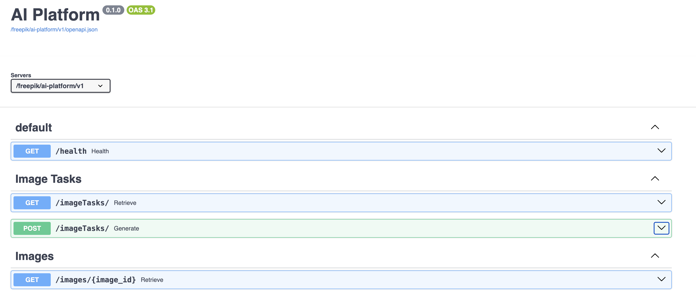

# Project overview
This project is an asynchron messages that allows you to create, update, delete and list machine learning generated images using [🧨Diffusers](https://huggingface.co/docs/diffusers/index)

In this example you can see a fast demo using [pretrained model runwayml/stable-diffusion-v1-5](https://huggingface.co/runwayml/stable-diffusion-v1-5):


## FastAPI
This project uses FastAPI as the main framework to create the API. The three endpoints implemented are:
- health: this endpoint allows you to check the health of the API.
- image_tasks: this endpoint allows you to create, and retrieve image creation tasks.
- images: this endpoint allows you get an image given a task id. This endpoint acts as a proxy to the image service.

This OpenAPi shows the three endpoints implemented. 


## Celery
This well known library is used to create the tasks that are going to be executed by the workers. The tasks are created by the image_tasks endpoint and are executed by the workers. The workers are going to create the images and store them in the image service.

## Redis
This project uses Redis as the message broker to send the tasks to the workers. The workers are going to get the tasks from the message broker and execute them.

## Flower
This service is used to monitor the Celery workers. It is a simple web based tool that allows you to monitor the tasks that are being executed by the workers. It is a simple tool that allows you to monitor the tasks that are being executed by the workers.

## MongoDB
This project uses MongoDB as the main database to store the tasks and images information.
An example of task document is:
```json
{
  "_id": "887c90ed-192d-4de8-a381-d643a989639c",
  "prompt": "una gallina sobre una mesa",
  "status": "completed",
  "generation_steps": 50,
  "url": "http://0.0.0.0:8000/freepik/ai-platform/v1/images/887c90ed-192d-4de8-a381-d643a989639c"
}
```

# Project local setup
## API setup
Clone the project:
```bash
git clone https://github.com/ssoto/ai-platform-api.git api
cd api
```
You are going to need to have [Docker](https://www.docker.com/) installed in your machine or something similar like [Rancher](https://rancher.com/) to run the project.

Then start compiling proper images and running the project:
```bash
docker-compose build  --build-arg ENV=docker workers api 
docker-compose up -d
```
When all the services are up and running you can access [localhost API](http://127.0.0.1:8000/docs)

If you want to monitor the workers you can use Flower:
```bash
docker-compose up -d flower
```

## Workers setup, without containers
This guide shows how to run the workers locally, not in a container.

To run the celery workers you need to install [python 3.11](https://www.python.org/downloads/) and poetry:
```bash
python -m pip install poetry
poetry install
```

Once you have the project installed you can run the workers with the following commands:
```bash
export ENV=local
celery -A ai_platform.task_queue.main worker --queues default --pool solo -n worker-01 -l INFO 
```

You need to set the ENV variable to local to run the workers locally.

## Workers setup, with containers

*CAVEAT*: The workers are not going to work properly in a container because you will need high cpu or GPU to run the workers. The workers are going to be very slow in a container.

To run the workers in a container you need to build the worker image and run the container:
```bash
docker build --build-arg ENV=docker workers
docker compose up -d worker --scale worker=2
```